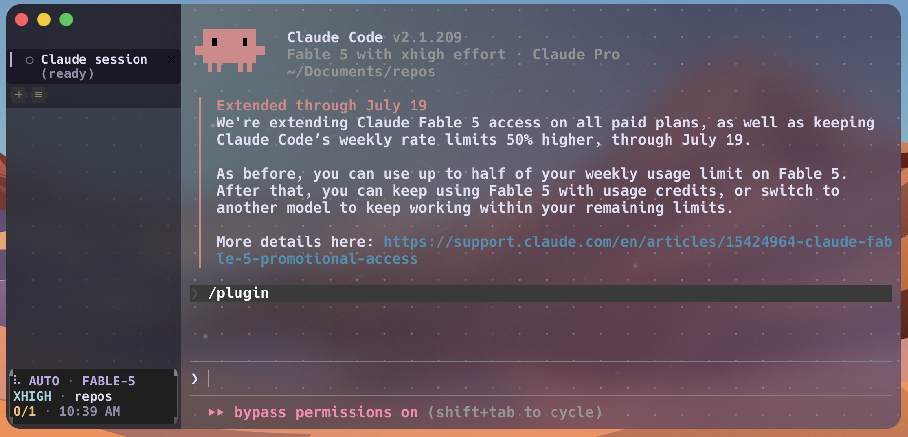

# MTerm

MTerm turns WezTerm's vertical tab rail into a calm control center for shell and AI coding sessions.
It preserves normal terminal behavior while adding named categories, activity subtitles, stable focus, compact long-command output, and a translucent animated Rosé Pine appearance.

This directory contains the complete user-level setup needed to reproduce the experience from this fork.



## Included files

| Path | Purpose |
| --- | --- |
| `wezterm.lua` | Complete MTerm WezTerm configuration |
| `assets/mterm-aurora.png` | True-alpha animated aurora background |
| `assets/mterm-dots.png` | Static Retina dot field |
| `tools/generate-wezterm-aurora.swift` | Reproducible macOS asset generator |
| `hooks/session-status.sh` | Copilot activity, state, and session-label adapter |
| `hooks/session-status.json` | Copilot lifecycle-hook registration |
| `hooks/wezterm-shell-pane.sh` | Focus-safe compact panel for long foreground commands |
| `hooks/wezterm-shell-panes.json` | Copilot pre-tool hook registration for shell commands |
| `hooks/claude-code/session-status.sh` | Claude Code activity, state, and session-label adapter |
| `hooks/claude-code/wezterm-shell-pane.sh` | Claude Code focus-safe compact panel adapter |
| `hooks/claude-code/settings-hooks.json` | Hook registrations to merge into `~/.claude/settings.json` |

The Rust implementation lives in the normal source tree and is part of the fork diff.

## Main controls

| Control | Action |
| --- | --- |
| `+` button | Open a new shell tab |
| `≡` button | Add or rename a category above the active tab |
| Drag a category heading | Move that category and all of its tabs as one unit |
| Right-click a tab | Rename the tab or add a category divider above it |
| Right-click a category heading | Rename or remove that divider |
| Drag a tab | Reorder that individual tab |
| Drag the rail edge | Resize the vertical tab rail |
| `Cmd+Shift+G` | Add or rename a category above the active tab |
| `Cmd+Shift+R` | Rename the active tab |
| `Cmd+Shift+C` | Toggle calm mode |

On macOS, the glass surface extends to the window edge while retaining the native traffic-light controls.
The original `AUTO`, model, effort, repository, session count, and clock strip is anchored in a bordered glass card at the bottom of the rail.
It remains one line on wide rails and wraps at separator boundaries on narrow rails.
When the tab list is taller than the available rail, the visible tab window follows the active tab while the toolbar and footer remain pinned.

The `≡` button operates on the active tab.
If the active tab is already a category anchor, the same prompt renames that category.
If it is inside an existing category, adding a divider splits the category at that tab.

Category headings intentionally have no session-status icon.
Normal tabs preserve the existing icon language:

| State | Icon |
| --- | --- |
| Working | Animated braille spinner |
| Done | `✓` |
| Ready | `○` |
| Needs input | `!` |
| Plain shell | `>` |

## Activity subtitles

Vertical tabs may display a muted second line such as `(coding)`, `(testing)`, `(researching)`, `(waiting on deployment)`, or `(monitoring deployment)`.
Tabs without activity metadata use the original single-line rendering path.
Horizontal tab bars ignore categories and activity subtitles.

The Rust renderer is harness-agnostic.
Adapters translate lifecycle and tool events into terminal metadata.

### Generic metadata contract

`WEZTERM_ACTIVITY` is the public activity subtitle.
Its value should be a short present-participle phrase or state phrase no longer than 48 characters.

The bundled Copilot adapter also emits:

| User variable | Values | Purpose |
| --- | --- | --- |
| `COPILOT_STATE` | `working`, `done`, `idle`, `input` | Selects the existing status icon and color |
| `COPILOT_LABEL` | Free text | Supplies a stable session label |
| `WEZTERM_ACTIVITY` | Free text | Supplies the muted activity subtitle |

WezTerm user variables use OSC 1337 with a Base64-encoded value:

```bash
value="$(printf '%s' 'researching' | base64 | tr -d '\r\n')"
printf '\033]1337;SetUserVar=WEZTERM_ACTIVITY=%s\007' "$value"
```

When user-variable passthrough is unavailable, the adapter appends this fallback marker to the terminal title:

```text
 · doing: <activity>
```

The renderer recognizes the fallback without putting vendor-specific logic in Rust.

## Focus-safe command panels

The shell adapter leaves commands under two seconds in the normal terminal flow.
Longer foreground commands receive a compact 18 percent bottom panel that streams output.
Commands launched from background tabs never create a panel.
Panel creation and cleanup preserve the pane that was focused before the operation.

The adapter requires `bash`, `jq`, `base64`, `mkfifo`, `pgrep`, `shlock`, and `wezterm cli`.

## Install the user configuration

Build and install this fork first.
Then copy the bundled configuration and assets:

```bash
mkdir -p ~/.config/wezterm/assets
cp docs/mterm/wezterm.lua ~/.config/wezterm/wezterm.lua
cp docs/mterm/assets/mterm-aurora.png ~/.config/wezterm/assets/
cp docs/mterm/assets/mterm-dots.png ~/.config/wezterm/assets/
```

The bundled configuration uses `WEZTERM_DEFAULT_CWD` when it is set.
Otherwise it uses `~/Documents/Repos` when that directory exists, then safely falls back to the home directory.

## Install the Copilot adapter

Copy the scripts and hook registrations:

```bash
mkdir -p ~/.copilot/hooks
cp docs/mterm/hooks/session-status.sh ~/.copilot/hooks/
cp docs/mterm/hooks/session-status.json ~/.copilot/hooks/
cp docs/mterm/hooks/wezterm-shell-pane.sh ~/.copilot/hooks/
cp docs/mterm/hooks/wezterm-shell-panes.json ~/.copilot/hooks/
chmod +x ~/.copilot/hooks/session-status.sh
chmod +x ~/.copilot/hooks/wezterm-shell-pane.sh
```

Restart Copilot CLI sessions after installing the hook files.
Set `updateTerminalTitle` to `false` in Copilot CLI settings so the adapter remains the source of truth for tab titles.

The activity adapter reads Copilot hook payloads but emits only the generic WezTerm contract.
A Claude Code adapter that emits the same variables ships in `hooks/claude-code/`; other harnesses (Codex, etc.) can follow the same thin-adapter pattern.

## Install the Claude Code adapter

Copy the scripts and register the hooks:

```bash
mkdir -p ~/.claude/hooks
cp docs/mterm/hooks/claude-code/session-status.sh ~/.claude/hooks/
cp docs/mterm/hooks/claude-code/wezterm-shell-pane.sh ~/.claude/hooks/
chmod +x ~/.claude/hooks/session-status.sh ~/.claude/hooks/wezterm-shell-pane.sh
```

Merge the `hooks` block from `hooks/claude-code/settings-hooks.json` into `~/.claude/settings.json`, and set `CLAUDE_CODE_DISABLE_TERMINAL_TITLE=1` in that file's `env` section so the adapter remains the source of truth for tab titles.

Differences from the Copilot adapter: labels come from the Claude Code session title or the first prompt line (there is no `workspace.yaml`), per-session caches live under `~/.claude/wezterm-state/`, and the command-panel rewrite uses the PreToolUse `hookSpecificOutput.updatedInput` mechanism. Commands run with `run_in_background` are left untouched. New Claude Code sessions pick up the hooks; running sessions must be restarted.

## Build the fork

For a focused development build:

```bash
cargo check -p wezterm-gui
cargo build -p wezterm-gui --release
```

On macOS, an existing app bundle can be updated for local testing:

```bash
cp target/release/wezterm-gui /Applications/WezTerm.app/Contents/MacOS/wezterm-gui
codesign --force --sign - /Applications/WezTerm.app/Contents/MacOS/wezterm-gui
codesign --verify --verbose=2 /Applications/WezTerm.app/Contents/MacOS/wezterm-gui
```

Quit and reopen WezTerm after replacing the GUI executable.
Running GUI processes keep the old executable in memory.

## Regenerate the ambient assets

The generator uses macOS AppKit, ImageIO, and UniformTypeIdentifiers:

```bash
swift docs/mterm/tools/generate-wezterm-aurora.swift \
  docs/mterm/assets/mterm-aurora.png \
  docs/mterm/assets/mterm-dots.png
```

The generated aurora is a 240-frame, 30 FPS APNG with real alpha and an exact eight-second loop.
Its cyber-organic layer uses small thin dashed strands and independently drifting particles without glow or pulse rings.
WezTerm honors the APNG's intrinsic 33/34 ms frame delays, while `config.max_fps = 120` keeps the renderer ceiling above the authored 30 FPS.
The dot layer is a static 1920 by 1200 PNG.

## Architecture

Category names are stored directly on `mux::Tab`.
They are exposed to Lua through `MuxTab:get_group()` and `MuxTab:set_group()`.
The first tab in a category acts as its divider anchor.
All following tabs belong to that category until the next divider.

The vertical renderer inserts category headings and optional subtitle rows without changing the ungrouped single-line tab path.
The `≡` button emits the same stable-tab-ID action used by the right-click menu.
It does not activate a background tab.

Dragging a category heading swaps adjacent contiguous tab ranges in the mux window.
The active tab is tracked by ID, so moving a category does not change focus.

## Current limitations

Category metadata is local mux state and is not serialized by the remote mux protocol.
Closing a category's anchor tab removes that divider instead of transferring it to the next tab.
Category dragging reorders complete named categories and does not move a category above the initial ungrouped tab prefix.
Horizontal tab bars intentionally omit category headings, category controls, and activity subtitles.

## Preparing a later commit

All MTerm source changes and supporting files now live in this repository.
Review `git status` and `git diff` before creating a commit.
The generated APNG stays below GitHub's individual-file limit but may make the first push slower.

Do not commit user-specific settings, credentials, session state, or local backup executables.
